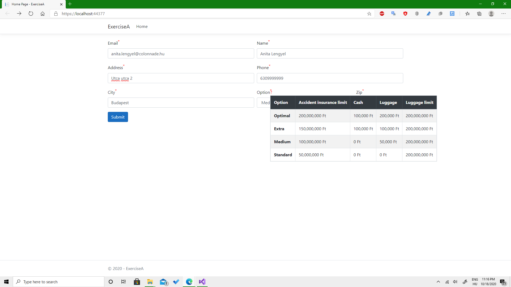
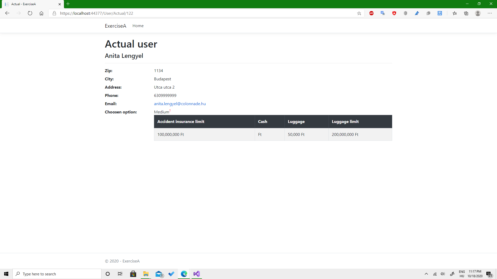

# Colonnade_application
## Index:

## User:

## Test application for Colonnade
- For the web app I used ASP.NET Core, HTML, CSS, Javascript. For the database: Entity framework, for the models, controllers and services: C#.
- The different excersises can be found on different **feature branches** *(I used gitflow workflow)*. I didn't want to merge them into the develop branch as, on one hand I consider your supervision as a check for a pull request. And on the other hand, I had problem with UIPath that I couldn't solve: I couldn't make the robot to send email.
